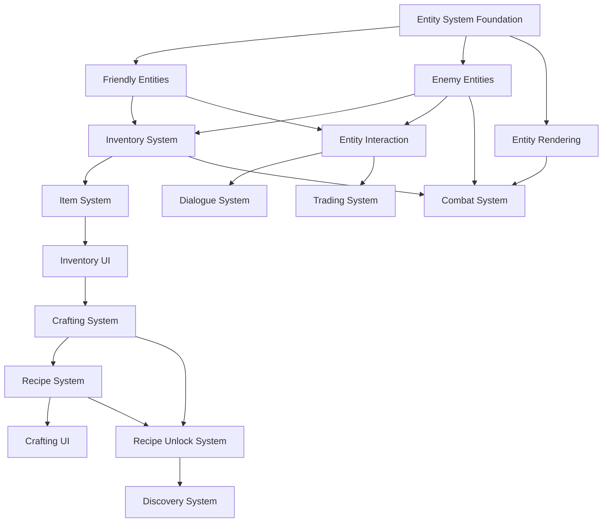

# Voxel Game Development Roadmap
**Project**: Java Voxel Game (LWJGL 3.3.6)  
**Created**: 2026-01-31  
**Scope**: Entity Systems, Inventory, Crafting, and Recipe Management  

---

## Overview

This roadmap outlines the complete implementation plan for adding comprehensive entity and crafting systems to the voxel game. The plan is designed to be modular, allowing for incremental development and testing at each phase.

---

## Phase 1: Entity System Foundation (Week 1-2)

### 1.1 Core Entity Architecture

#### New Files to Create:
```
src/main/java/com/jless/voxelGame/entities/
├── Entity.java                  # Base entity class
├── EntityManager.java           # Entity lifecycle management
├── EntityType.java              # Entity type definitions
└── components/
    ├── PositionComponent.java    # World position
    ├── HealthComponent.java      # Health/damage system
    ├── MovementComponent.java    # Movement and physics
    ├── RenderComponent.java      # Rendering properties
    └── AIComponent.java         # AI behavior base
```

#### Core Entity.java Implementation:
```java
public abstract class Entity {
    protected int id;
    protected EntityType type;
    protected Vector3f position;
    protected boolean alive;
    protected List<Component> components;
    
    public abstract void update(float dt, World world);
    public abstract void render();
    public abstract void onDeath();
    
    // Component system methods
    public <T extends Component> T getComponent(Class<T> type);
    public void addComponent(Component component);
    public void removeComponent(Class<? extends Component> type);
}
```

#### EntityManager Features:
- Entity lifecycle management (create, update, destroy)
- Spatial indexing for performance
- Component querying systems
- Entity pooling for memory efficiency

### 1.2 Friendly Entity System

#### New Files:
```
src/main/java/com/jless/voxelGame/entities/friendly/
├── FriendlyEntity.java          # Base friendly entity
├── Villager.java               # NPC villager
├── Pet.java                   # Tameable pets
└── components/
    ├── FriendshipComponent.java  # Relationship management
    └── TradeComponent.java       # Trading capabilities
```

#### Villager Implementation:
```java
public class Villager extends FriendlyEntity {
    private VillagerProfession profession;
    private TradeInventory tradeInventory;
    private FriendshipComponent friendship;
    
    @Override
    public void update(float dt, World world) {
        super.update(dt, world);
        updateAI(dt, world);
        handlePlayerInteraction();
    }
    
    private void updateAI(float dt, World world) {
        // Pathfinding to work locations
        // Schedule-based activities
        // Interaction with environment
    }
}
```

### 1.3 Enemy Entity System

#### New Files:
```
src/main/java/com/jless/voxelGame/entities/enemy/
├── EnemyEntity.java            # Base enemy entity
├── Zombie.java                 # Basic melee enemy
├── Archer.java                 # Ranged enemy
├── Boss.java                   # Boss entities
└── components/
    ├── AggroComponent.java      # Target acquisition
    ├── AttackComponent.java     # Combat mechanics
    └── LootComponent.java       # Drop system
```

#### Enemy AI Behaviors:
- **State Machine**: Idle → Patrol → Chase → Attack → Flee
- **Pathfinding**: A* navigation in 3D voxel world
- **Combat**: Melee attacks, ranged attacks, special abilities
- **Loot System**: Item drops with probability tables

### 1.4 Entity Rendering System

#### New Files:
```
src/main/java/com/jless/voxelGame/entities/rendering/
├── EntityRenderer.java         # Entity rendering manager
├── EntityModel.java            # 3D model handling
└── AnimationSystem.java        # Entity animations
```

#### Rendering Features:
- Entity models using existing CubeRenderer
- Skeletal animation support
- Equipment and item visualization
- LOD system for performance

---

## Phase 2: Inventory System (Week 3)

### 2.1 Core Inventory Architecture

#### New Files:
```
src/main/java/com/jless/voxelGame/inventory/
├── Inventory.java              # Base inventory class
├── ItemStack.java              # Item stack representation
├── InventorySlot.java          # Individual inventory slot
├── PlayerInventory.java        # Player-specific inventory
└── ItemRegistry.java           # Item type registry
```

#### ItemStack Implementation:
```java
public class ItemStack {
    private ItemType type;
    private int quantity;
    private int maxStackSize;
    private ItemMetadata metadata;
    
    public ItemStack(ItemType type, int quantity) {
        this.type = type;
        this.quantity = Math.min(quantity, type.getMaxStackSize());
        this.maxStackSize = type.getMaxStackSize();
    }
    
    public boolean canCombine(ItemStack other) {
        return type.equals(other.type) && 
               quantity < maxStackSize &&
               Objects.equals(metadata, other.metadata);
    }
}
```

#### Inventory Features:
- **Grid-based storage**: 9x4 main inventory, hotbar 9 slots
- **Stack management**: Auto-stacking, max stack limits
- **Serialization**: Save/load inventory state
- **Event system**: Inventory change notifications

### 2.2 Item System

#### New Files:
```
src/main/java/com/jless/voxelGame/items/
├── Item.java                   # Base item class
├── ItemType.java              # Item type definitions
├── Tool.java                   # Tool items (pickaxe, axe, etc.)
├── Weapon.java                 # Weapons
├── Consumable.java             # Food, potions
└── Material.java               # Raw materials
```

#### Item Properties:
```java
public class ItemType {
    private String id;
    private String name;
    private int maxStackSize;
    private ItemCategory category;
    private Map<String, Object> properties;
    
    // Item-specific properties
    private ToolProperties toolProperties;  // Mining speed, durability
    private WeaponProperties weaponProperties;  // Damage, attack speed
    private FoodProperties foodProperties;  // Hunger restore, effects
}
```

### 2.3 Inventory UI System

#### New Files:
```
src/main/java/com/jless/voxelGame/ui/inventory/
├── InventoryScreen.java        # Main inventory UI
├── HotbarRenderer.java        # Hotbar display
├── InventorySlot.java          # Individual slot UI
└── DragDropHandler.java       # Item manipulation
```

#### UI Features:
- **Visual feedback**: Hover effects, selection highlights
- **Drag & drop**: Move items between slots
- **Stack splitting**: Right-click to split stacks
- **Quick actions**: Drop items, use items from inventory

---

## Phase 3: Crafting System (Week 4)

### 3.1 Recipe System Foundation

#### New Files:
```
src/main/java/com/jless/voxelGame/crafting/
├── Recipe.java                 # Base recipe class
├── RecipeRegistry.java         # Recipe management
├── CraftingGrid.java          # Crafting grid logic
├── RecipeType.java            # Recipe types (shaped, shapeless, etc.)
└── ingredients/
    ├── ItemIngredient.java     # Item-based ingredients
    ├── GroupIngredient.java    # Item group ingredients
    └── TagIngredient.java     # Tag-based ingredients
```

#### Recipe Implementation:
```java
public class ShapedRecipe implements Recipe {
    private int width, height;
    private Ingredient[][] ingredients;
    private ItemStack result;
    private String id;
    private boolean unlocked;
    
    @Override
    public boolean matches(CraftingGrid grid) {
        // Check if grid pattern matches recipe
        // Support rotation and mirroring
        return checkPattern(grid);
    }
    
    @Override
    public ItemStack craft(CraftingGrid grid) {
        if (!matches(grid)) return null;
        
        // Remove ingredients from grid
        consumeIngredients(grid);
        
        // Return result (copy to avoid modifying recipe)
        return new ItemStack(result.getType(), result.getQuantity());
    }
}
```

### 3.2 Crafting Categories

#### Recipe Types:
1. **Basic Crafting**: 3x3 grid crafting table
2. **Smelting**: Furnace recipes (ore → ingot)
3. **Alchemy**: Brewing stand recipes
4. **Enchanting**: Enhancement recipes
5. **Advanced Crafting**: Special workstations

#### Example Recipes:
```java
// Basic tools
Recipe woodenPickaxe = new ShapedRecipe(
    "wooden_pickaxe",
    new Ingredient[][] {
        {new ItemIngredient("oak_planks"), new ItemIngredient("oak_planks"), new ItemIngredient("oak_planks")},
        {null, new ItemIngredient("stick"), null},
        {null, new ItemIngredient("stick"), null}
    },
    new ItemStack(ItemType.WOODEN_PICKAXE, 1)
);

// Smelting
Recipe ironIngot = new SmeltingRecipe(
    "iron_ingot",
    new ItemIngredient("iron_ore"),
    new ItemStack(ItemType.IRON_INGOT, 1),
    200  // Smelting time in ticks
);
```

### 3.3 Recipe Unlock System

#### New Files:
```
src/main/java/com/jless/voxelGame/crafting/unlock/
├── RecipeUnlockManager.java    # Unlock system manager
├── UnlockCondition.java        # Base unlock condition
├── ItemUnlock.java            # Unlock by obtaining item
├── DiscoveryUnlock.java       # Unlock by discovery
└── QuestUnlock.java           # Unlock by quest completion
```

#### Unlock Mechanisms:
```java
public class RecipeUnlockManager {
    private Map<String, Recipe> allRecipes;
    private Set<String> unlockedRecipes;
    private List<UnlockCondition> unlockConditions;
    
    public void checkUnlocks(PlayerInventory inventory) {
        for (UnlockCondition condition : unlockConditions) {
            if (condition.isMet(inventory)) {
                unlockRecipes(condition.getRecipeIds());
            }
        }
    }
    
    public void unlockByDiscovery(ItemStack discoveredItem) {
        // Unlock recipes that use this item
        Set<String> recipesToUnlock = findRelatedRecipes(discoveredItem);
        unlockRecipes(recipesToUnlock);
    }
}
```

---

## Phase 4: Crafting UI System (Week 5)

### 4.1 Crafting Interface

#### New Files:
```
src/main/java/com/jless/voxelGame/ui/crafting/
├── CraftingScreen.java         # Main crafting UI
├── CraftingGrid.java          # Interactive crafting grid
├── RecipeBook.java           # Recipe browser
├── RecipeRenderer.java        # Individual recipe display
└── CraftingAnimations.java    # UI animations
```

#### Crafting Screen Features:
- **3x3 Crafting Grid**: Interactive item placement
- **Recipe Preview**: Show crafting result
- **Recipe Book**: Browse known recipes
- **Quick Crafting**: Favorite recipes for fast access

### 4.2 Recipe Discovery System

#### New Files:
```
src/main/java/com/jless/voxelGame/crafting/discovery/
├── RecipeDiscovery.java       # Discovery mechanics
├── HintSystem.java           # Recipe hints system
└── ProgressTracker.java      # Crafting progress tracking
```

#### Discovery Features:
- **Experimental Crafting**: Try combinations to discover recipes
- **Hint System**: Get hints for undiscovered recipes
- **Progress Tracking**: Track crafting milestones
- **Knowledge Sharing**: Trade recipe knowledge with villagers

---

## Phase 5: Advanced Features (Week 6-7)

### 5.1 Entity Interaction System

#### New Files:
```
src/main/java/com/jless/voxelGame/entities/interaction/
├── EntityInteraction.java     # Interaction handling
├── DialogueSystem.java        # NPC dialogue
├── TradingSystem.java        # Trading interface
└── QuestSystem.java          # Quest management
```

#### Interaction Features:
- **Dialogue Trees**: Complex conversations with NPCs
- **Trading Interface**: Buy/sell items with villagers
- **Quest System**: Task-based progression
- **Reputation System**: Entity relationship management

### 5.2 Advanced AI Behaviors

#### New Files:
```
src/main/java/com/jless/voxelGame/entities/ai/
├── PathfindingAI.java        # A* pathfinding
├── BehaviorTree.java         # AI behavior trees
├── StateMachine.java         # State-based AI
└── GoalOrientedAI.java       # Goal-oriented planning
```

#### AI Features:
- **Complex Behaviors**: Multi-step actions and planning
- **Group AI**: Coordinate attacks and defenses
- **Learning AI**: Adapt to player strategies
- **Environmental Awareness**: React to world changes

### 5.3 Combat System Enhancement

#### New Files:
```
src/main/java/com/jless/voxelGame/combat/
├── CombatSystem.java          # Combat mechanics
├── DamageCalculator.java      # Damage calculation
├── StatusEffects.java         # Buffs/debuffs
└── CombatAnimations.java      # Combat visual effects
```

#### Combat Features:
- **Weapon Types**: Melee, ranged, magic weapons
- **Armor System**: Damage reduction and durability
- **Status Effects**: Poison, burning, healing
- **Combat Animation**: Attack animations and effects

---

## Phase 6: Polish and Optimization (Week 8)

### 6.1 Performance Optimization

#### Areas to Optimize:
- **Entity Rendering**: Batch rendering for entities
- **Pathfinding**: Cached paths and hierarchical pathfinding
- **Inventory**: Optimized item stack operations
- **UI**: Efficient rendering and event handling

#### Profiling Targets:
- Entity update: <1ms for 100 entities
- Inventory operations: <0.1ms per operation
- UI rendering: 60 FPS with complex interfaces
- Memory usage: <500MB for full game state

### 6.2 Save System Integration

#### New Files:
```
src/main/java/com/jless/voxelGame/save/
├── EntitySaveManager.java     # Entity state saving
├── InventorySaveManager.java  # Inventory persistence
├── RecipeSaveManager.java     # Recipe unlock persistence
└── WorldSaveManager.java      # Complete world state
```

#### Save Features:
- **Entity State**: Position, health, AI state
- **Inventory**: Complete player and entity inventories
- **Recipe Progress**: Unlocked recipes and discovery progress
- **World Integration**: Seamless save/load with existing world system

---

## Implementation Dependencies



---

## Testing Strategy

### Unit Testing
- Entity component system
- Inventory operations and edge cases
- Recipe matching logic
- Save/load functionality

### Integration Testing
- Entity-world interactions
- Multi-entity scenarios
- Complex crafting chains
- Cross-system interactions

### Performance Testing
- Entity count scaling (10, 100, 1000 entities)
- Inventory operations under load
- Large crafting recipe databases
- Memory usage profiling

### User Testing
- UI/UX feedback collection
- Gameplay balance testing
- Discovery system engagement
- Performance on target hardware

---

## Milestones and Deliverables

### Week 1-2: Entity System Foundation ✅
- [ ] Base entity architecture
- [ ] Component system
- [ ] Entity manager
- [ ] Basic rendering

### Week 3: Inventory System ✅
- [ ] Core inventory mechanics
- [ ] Item system
- [ ] Inventory UI
- [ ] Save/load functionality

### Week 4: Crafting System ✅
- [ ] Recipe system
- [ ] Crafting logic
- [ ] Recipe unlock mechanics
- [ ] Basic crafting UI

### Week 5: Advanced UI ✅
- [ ] Recipe book interface
- [ ] Discovery system
- [ ] Enhanced crafting UI
- [ ] User feedback systems

### Week 6-7: Advanced Features ✅
- [ ] Entity interactions
- [ ] Advanced AI behaviors
- [ ] Combat system
- [ ] Dialogue and trading

### Week 8: Polish ✅
- [ ] Performance optimization
- [ ] Save system integration
- [ ] Bug fixes and polish
- [ ] Documentation and testing

---

## Technical Considerations

### Performance Targets
- **Entity Count**: Support 100+ entities simultaneously
- **Inventory**: <1ms for any inventory operation
- **Crafting**: <10ms for recipe matching
- **Memory**: <50MB for entity systems, <10MB for inventory

### Code Organization
- Follow existing package structure patterns
- Use dependency injection for testing
- Implement proper separation of concerns
- Maintain consistent coding standards

### Extensibility
- Plugin architecture for custom entities
- Scriptable recipe system
- Modular component design
- Configurable game balance parameters

---

## Risk Assessment

### High Risk Areas
1. **Entity Performance**: Large numbers of entities may impact performance
2. **Save System Complexity**: Integrating new systems with existing saves
3. **UI Complexity**: Managing multiple complex interfaces

### Mitigation Strategies
1. **Early Profiling**: Profile entity performance early and optimize
2. **Incremental Saves**: Save new systems incrementally
3. **UI Prototyping**: Prototype complex UIs early

### Backup Plans
1. **Simplified AI**: Use simpler AI if performance issues arise
2. **Basic Crafting**: Implement basic crafting before advanced features
3. **Modular UI**: Release UI components incrementally

---

## Success Metrics

### Technical Metrics
- Maintain 60 FPS with 50+ entities
- <100ms inventory response time
- <90% code coverage for core systems
- <5 critical bugs in beta testing

### User Experience Metrics
- Intuitive inventory management
- Engaging discovery mechanics
- Smooth entity interactions
- Positive user feedback on UI/UX

---

## Conclusion

This roadmap provides a comprehensive plan for implementing entity systems, inventory management, and crafting mechanics in the voxel game. The phased approach allows for incremental development, testing, and refinement at each stage.

The modular design ensures that each system can be developed and tested independently while maintaining integration with the existing codebase. The focus on performance, extensibility, and user experience will result in a robust and engaging game system.

**Next Steps**:
1. Begin Phase 1: Entity System Foundation
2. Set up development environment and testing framework
3. Implement core entity architecture
4. Create basic entity rendering system
5. Test with simple entities before proceeding to inventory system